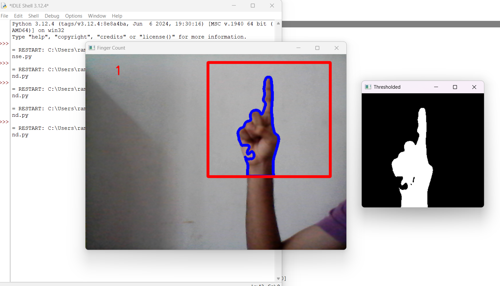
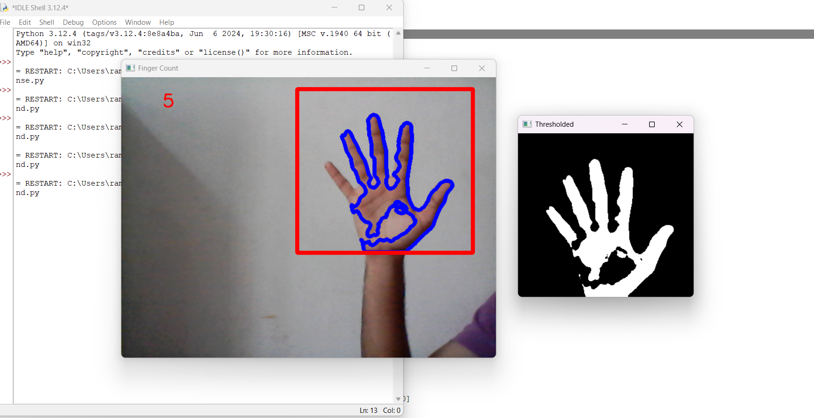

# Real-Time-Finger-Counter
The project aims to build a system that counts the number of fingers shown by a user in real-time using a webcam or camera feed. This is achieved through hand detection and finger recognition using computer vision techniques.
 
 
<h1>SCREENSHOTS</h1>

